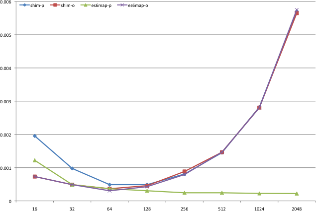

es6-map.js
==========

Yet another ES6 Map/Set implementation which avoids linear search when possible

Why reinvent the wheel?
-----------------------

Because the current implementations suck.  They are all O(n) *FOR ALL TYPES OF KEYS*.  We can do better than that!

https://github.com/dankogai/js-object-clone
> It is not impossible to handle circular references in JavaScript since you can check if the objects are identical via === operator. Yet it is very impractical without object ID like object_id of Ruby or refaddr of Perl. Without object ID you have to linear search just to check if the object is already visited. As a matter of fact the reference implementation of Map and Set of ES6 resorts to linear search.

So linear-searching objects are necessary but that restriction does not apply to primitives.  This implementation uses _hash_ for keys of primitive types so it is O(1) unless `typeof(key) === 'object'` (or `'function'` to be more exact.

Benchmark:
---------

The graph below is the average time taken to insert one element where x axis is the size of map and the y axis is time taken in ms.  See how bad O(n) can be!

See Also:
---------

+ http://wiki.ecmascript.org/doku.php?id=harmony:simple_maps_and_sets
+ https://github.com/paulmillr/es6-shim
